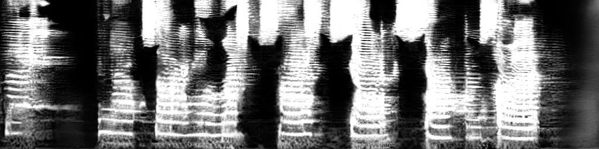
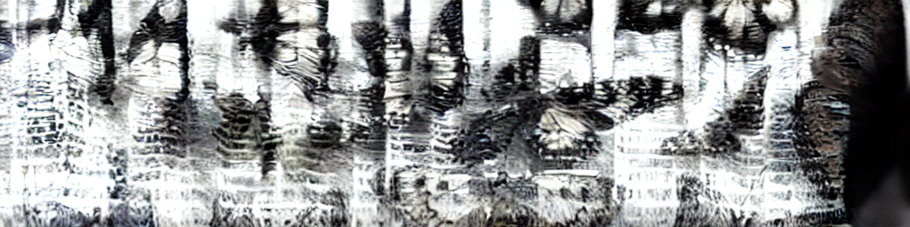
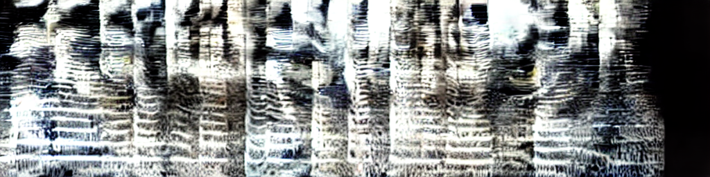
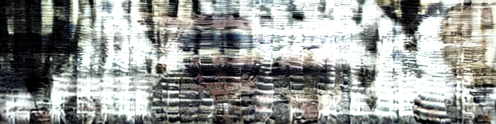
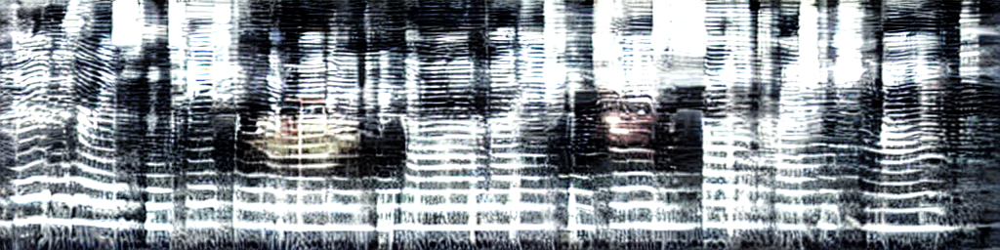

# Images That Speak

## Overview

This project aims to generate **images that are also speech spectrograms** — visual content that can be viewed as meaningful images while simultaneously encoding intelligible speech when converted to audio. The generated spectrograms serve a dual purpose: they appear as recognizable images to the human eye, yet when processed through a vocoder, they produce coherent spoken words or phrases.

<div align="center">
  
  <p><em>Example: An image of cats that encodes speech when played as a spectrogram</em></p>
</div>

Key capabilities:
- **Joint image-speech generation** using multimodal diffusion models
- **LoRA fine-tuning** of the Auffusion UNet for custom speech spectrogram generation
- **Data preprocessing** utilities for creating training datasets from speech audio

---

## Inspiration

This work is inspired by **"Images that Sound"** by Ziyang Chen, Daniel Geng, and Andrew Owens from the University of Michigan.

- 📄 Paper: [Images that Sound (arXiv 2024)](https://arxiv.org/abs/2405.12221)
- 🌐 Project Page: [https://ificl.github.io/images-that-sound/](https://ificl.github.io/images-that-sound/)
- 💻 Original Repository: [https://github.com/ificl/images-that-sound](https://github.com/ificl/images-that-sound)

---

## Environment Setup

```bash
conda env create -f environment.yml
conda activate soundify
```

**Hugging Face Authentication:**
```bash
python huggingface_login.py
```

---

## Project Structure

```
├── train_auffusion.py          # LoRA training for Auffusion UNet
├── imprint_joint_denoise.py    # Joint image-audio denoising generation
├── decode_spec_to_audio.py     # Convert spectrograms to audio
├── data/
│   └── generate_spectograms.py # Generate mel spectrograms from audio
└── src/
    ├── guidance/
    │   ├── auffusion.py        # Auffusion diffusion guidance
    │   └── stable_diffusion.py # Stable Diffusion guidance
    ├── models/components/
    │   └── auffusion_converter.py  # Vocoder and spectrogram utilities
    └── transformation/
        └── identity.py         # Identity transformation
```

---

## Usage

### 1. Data Preparation

The full data preparation pipeline is orchestrated by `data/run.sh`:

```bash
cd data
./run.sh
```

This script runs the following steps:
1. **Generate prompts** from a word list (`create_prompts_from_words.py`)
2. **Generate TTS audio** using Tacotron2 (`generate_tts.py`)
3. **Resize audio** to 10.24 seconds (`resize_audio.py`)
4. **Generate mel spectrograms** (`generate_spectograms.py`)
5. **Generate phoneme embeddings** for conditioning (`generate_phonemes.py`)

Configure the pipeline by editing the variables at the top of `run.sh`:
- `L`: Number of prompts to generate
- `W`: Words per prompt
- `TTS_MODEL`: Text-to-speech model
- `SAVE_PNGS`: Whether to save spectrogram visualizations

**Outputs:**
- `raw_audio/`: Generated TTS audio files
- `resized_audio/`: Audio padded/trimmed to 10.24s
- `spectograms/`: Mel spectrograms (`.npy` 256×1024) and optional `.png` visualizations
- `plbert_sentence_emb.npz`: Phoneme embeddings for training

### 2. LoRA Training

Fine-tune the Auffusion UNet with LoRA:

```bash
python train_auffusion.py \
    --manifest /path/to/manifest.csv \
    --out_dir ./output \
    --steps 2000 \
    --batch 2 \
    --lr 1e-4 \
    --lora_rank 8 \
    --fp16
```

**Key Training Parameters:**

| Parameter | Default | Description |
|-----------|---------|-------------|
| `--lora_rank` | 8 | LoRA rank for low-rank adaptation |
| `--lora_alpha` | 16.0 | LoRA scaling factor |
| `--lora_targets` | `to_q,to_k,to_v,to_out.0,ff.net.0.proj,ff.net.2` | Target layers for LoRA |
| `--lr` | 1e-4 | Learning rate |
| `--fp16` | False | Use mixed precision training |

**What Gets Trained:**
- LoRA adapter weights (A and B matrices) in attention and MLP layers
- Optional: Phoneme adapter (when using `--cond_type phoneme`)
- Optional: Base UNet weights (when using `--unfreeze_patterns`)

### 3. Joint Denoising Generation

Generate images that sound using the imprint method with optional LoRA:

```bash
python imprint_joint_denoise.py \
    --image_prompt "a photo of a cat" \
    --audio_prompt "a cat meowing" \
    --out_dir ./output \
    --num_inference_steps 50 \
    --image_guidance_scale 7.5 \
    --audio_guidance_scale 7.5
```

**With LoRA weights:**
```bash
python imprint_joint_denoise.py \
    --image_prompt "a photo of a cat" \
    --audio_prompt "a cat meowing" \
    --lora_path ./checkpoints/lora.pt \
    --out_dir ./output
```

### 4. Spectrogram to Audio

Convert a generated spectrogram to audio:

```bash
python decode_spec_to_audio.py \
    --spec_path ./output/spec.npy \
    --out_dir ./output
```

---

## Outputs

The generation scripts produce:
- `*_img.png` - Generated image
- `*_spec.png` - Spectrogram visualization  
- `*.npy` - Raw spectrogram data
- `*.wav` - Synthesized audio (16kHz)

---

## Example Outputs

<table>
<tr>
<td align="center"><br/><b>Image:</b> butterflies<br/><b>Speech:</b> "disease baby happen budget mouth down" <a href="out/batch1/000007.wav">[wav]</a></td>
<td align="center"><br/><b>Image:</b> tiger faces painting<br/><b>Speech:</b> "only reach eye bring beyond wife" <a href="out/batch1/000009.wav">[wav]</a></td>
</tr>
<tr>
<td align="center"><br/><b>Image:</b> hot air balloons<br/><b>Speech:</b> "thing million risk range high allow" <a href="out/batch1/000016.wav">[wav]</a></td>
<td align="center"><br/><b>Image:</b> cars racing<br/><b>Speech:</b> "west yeah ability blue reality their" <a href="out/batch1/000018.wav">[wav]</a></td>
</tr>
</table>

---

## Acknowledgements

This work builds upon:
- [Images that Sound](https://github.com/ificl/images-that-sound) - Original paper and codebase
- [Auffusion](https://github.com/happylittlecat2333/Auffusion) - Audio latent diffusion
- [Stable Diffusion](https://huggingface.co/runwayml/stable-diffusion-v1-5) - Image latent diffusion
- [diffusers](https://github.com/huggingface/diffusers) - Diffusion model library

